<h1>Nero</h1>

Full-Stack Developer · AI Automation Builder

---

## Projects

| Project | Description | Stack |
|---|---|---|
| [JadeTracker](https://github.com/Jadessz/JadeTracker) | Full-stack task tracking app | `React` `Node.js` `PostgreSQL` |

---

## Current focus
- Building AI-powered applications
- Workflow automation with n8n
- Cloud infrastructure
- Full-stack web development

---

<i>"Code. Automate. Improve."</i>

