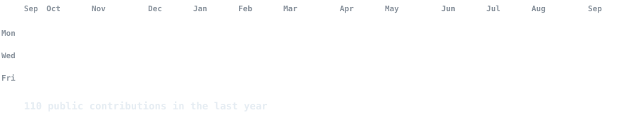

# Hey, I'm Nero

  

  
  

Full-stack developer focused on AI-powered apps, automation, and clean product experiences.
Most of my day-to-day work lives in private employer repos — the public graph below is only part of the story.

---

### `nero@github ~ $ ./contributions.sh`

> Public activity only. Private employer work isn't reflected here.

  

---

### `nero@github ~ $ ./stack.sh`

**Languages**

**Frontend**

**Backend & Data**

**Auth, Cloud & Automation**

---

### `nero@github ~ $ ./stats.sh`

> These cards pull from **public repositories only**, so they underrepresent private client/employer work.

  
  

  

---

### `nero@github ~ $ ./side-projects.sh`

Things I tinker with between client work:

| Project | What it is |
| --- | --- |
| [JadeTracker](https://github.com/Jadessz/JadeTracker) | Full-stack task tracker built for fast day-to-day use |
| [LGENO](https://github.com/Jadessz/LGENO) | Finds local businesses with no website via Google Places so you can pitch web work |
| [JadeBlackjack](https://github.com/Jadessz/JadeBlackjack) | Blackjack strategy trainer that doubles as a quick game |

---

### `nero@github ~ $ ./focus.sh`

- Building AI-powered applications
- Workflow automation with **n8n**
- Cloud infrastructure & deployment
- Full-stack product development with Next.js + Supabase

---

Thanks for stopping by — always happy to connect.

